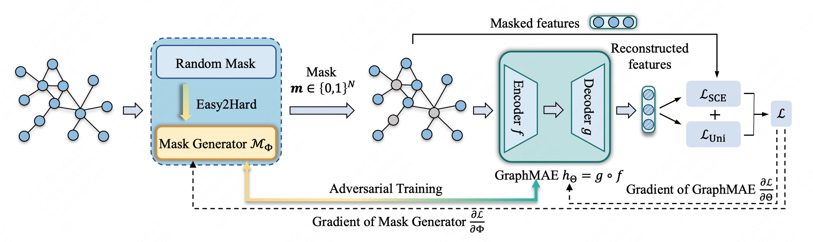

# Rethinking Graph Masked Autoencoders through Alignment and Uniformity



This is the code for the AAAI'24 Paper: [Rethinking Graph Masked Autoencoders through Alignment and Uniformity](https://www.arxiv.org/abs/2402.07225).


## Usage

For quick start, you could run the scripts:

**Node classification**

```bash
sh scripts/run_transductive.sh <dataset_name> <gpu_id> # for transductive node classification
# example: sh scripts/run_transductive.sh cora/citeseer/pubmed/ogbn-arxiv 0
sh scripts/run_inductive.sh <dataset_name> <gpu_id> # for inductive node classification
# example: sh scripts/run_inductive.sh reddit/ppi 0

# Or you could run the code manually:
# for transductive node classification
python main_transductive.py --dataset cora --seed 0 --device 0 --use_cfg
# for inductive node classification
python main_inductive.py --dataset ppi --seed 0 --device 0 --use_cfg
```
Supported datasets:
* transductive node classification:  `cora`, `citeseer`, `pubmed`,` corafull`, `wikics`,`ogbn-arxiv`,`flickr`
* inductive node classification: `ppi`, `reddit` 


**Graph classification**

```bash
sh scripts/run_graph.sh <dataset_name> <gpu_id>
# example: sh scripts/run_graph.sh mutag/imdb-b/imdb-m/proteins/... 0 

# Or you could run the code manually:
python main_graph.py --dataset IMDB-BINARY  --seed 0 --device 0 --use_cfg
```
Supported datasets: 

- `IMDB-BINARY`, `IMDB-MULTI`, `PROTEINS`, `MUTAG`,  `COLLAB`,`PTC-MR`,`REDDIT-BINERY`


## Requirements

- Python >= 3.9.5
- PyTorch >= 1.11.0 
- dgl >= 1.0.0
- scikit-learn >= 1.0.2
- PyYAML
- ogb
- tqdm

## Citation

Please cite our paper if you use the code:

```
@article{wang2024augmae,
  author       = {Liang Wang and Xiang Tao and Qiang Liu and Shu Wu and Liang Wang},
  title        = {Rethinking Graph Masked Autoencoders through Alignment and Uniformity},
  journal      = {arXiv},
  volume       = {abs/2402.07225},
  year         = {2024}
}
```

